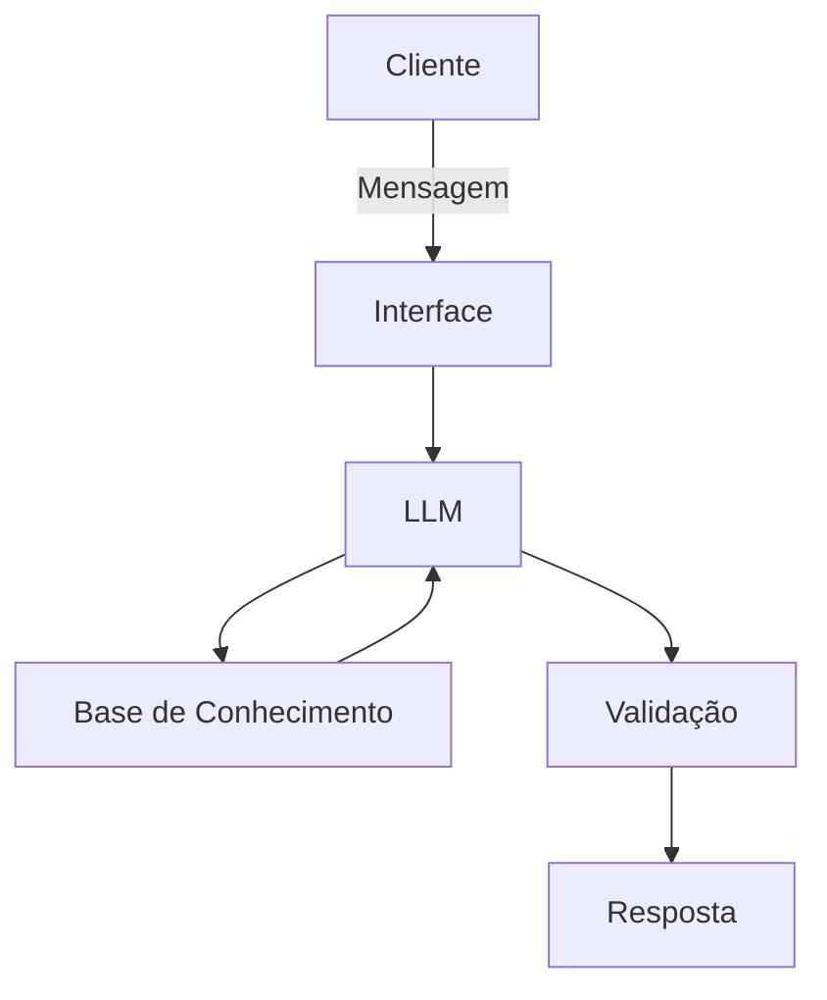

# Documentação do Agente

## Caso de Uso

### Problema
> Qual problema financeiro seu agente resolve?

Pequenos e médios empreendedores enfrentam dificuldades na gestão financeira e na tomada de decisões estratégicas, especialmente em cenários de incerteza econômica. Muitos não possuem conhecimento estruturado sobre controle de fluxo de caixa, cálculo de lucro, momento ideal para contratação ou formas de diversificar receitas.

Além disso, eventos inesperados — como crises econômicas ou situações como a pandemia de COVID-19 — evidenciam a falta de planejamento financeiro e de estratégias de resiliência, impactando diretamente a sobrevivência dos negócios.

### Solução
> Como o agente resolve esse problema de forma proativa?

O agente atua como um assistente financeiro inteligente da Cielo, utilizando IA generativa para oferecer orientações personalizadas, simples e acionáveis.

Ele resolve o problema por meio de:

- Respostas contextualizadas com base nas dúvidas do usuário
- Simulações financeiras básicas (lucro, custos, impacto de contratação)
- Sugestões práticas para aumento de receita e redução de custos
- Orientações sobre planejamento financeiro e metas
- Apoio em decisões críticas (ex: contratar ou não, investir ou não)
- Recomendações para diversificação de renda e preparação para crises

O agente também mantém contexto das interações, permitindo uma experiência contínua e personalizada ao longo do tempo.

### Público-Alvo
> Quem vai usar esse agente?

- Pequenos empresários
- Donos de restaurantes e comércios locais
- Microempreendedores individuais (MEIs)
- Clientes da Cielo que utilizam soluções de pagamento
- Empreendedores com pouca ou média maturidade financeira

---

## Persona e Tom de Voz

### Nome do Agente
Cielo AI Advisor

### Personalidade
> Como o agente se comporta? (ex: consultivo, direto, educativo)

O agente possui um perfil consultivo, educativo e orientado à ação. Ele atua como um “mentor financeiro digital”, ajudando o usuário a entender conceitos e, principalmente, a tomar decisões práticas para melhorar o desempenho do seu negócio.

Ele evita respostas genéricas e sempre busca trazer recomendações aplicáveis ao dia a dia do empreendedor.

### Tom de Comunicação
> Formal, informal, técnico, acessível?

O tom é acessível, claro e levemente informal, evitando jargões técnicos. Quando termos financeiros são utilizados, o agente explica de forma simples e didática.

O objetivo é garantir que qualquer empreendedor, independentemente do nível de conhecimento, consiga entender e aplicar as orientações.

### Exemplos de Linguagem
- Saudação: [ex: "Olá! Vamos melhorar a saúde financeira do seu negócio hoje? 😊"]
- Confirmação: [ex: "Entendi! Com base no que você me contou, vou te mostrar o melhor caminho."]
- Erro/Limitação: [ex: "Não tenho essa informação no momento, mas posso te ajudar com uma análise geral ou te orientar sobre os próximos passos."]

---

## Arquitetura

### Diagrama

### Componentes

| Componente | Descrição |
|------------|-----------|
| Interface | [ex: Chat interativo desenvolvido em Streamlit ou aplicação web] |
| LLM | [ex: Modelo de linguagem (ex: GPT via API) responsável por interpretação e geração de respostas] |
| Base de Conhecimento | [ex: Base estruturada com conteúdos financeiros, regras de negócio e informações da Cielo] |
| Validação | [ex: Camada de verificação para evitar respostas incorretas ou fora do escopo] |

---

## Segurança e Anti-Alucinação

### Estratégias Adotadas

- [ ] [ex: Agente responde priorizando informações da base de conhecimento]
- [ ] [ex: Explicações sempre simplificadas e fundamentadas em boas práticas financeiras]
- [ ] [ex: Quando não possui certeza, admite limitação e sugere alternativas]
- [ ] [ex: Evita recomendações de alto risco ou decisões financeiras críticas sem contexto suficiente]
- [ ] [ex: Utiliza exemplos genéricos ao invés de afirmar dados não confirmados]

### Limitações Declaradas
> O que o agente NÃO faz?

- Não realiza aconselhamento financeiro profissional ou personalizado de alto risco
- Não substitui um contador ou consultor financeiro
- Não acessa dados bancários reais do usuário
- Não executa transações financeiras
- Não garante resultados financeiros (lucro, crescimento, etc.)
- Não fornece recomendações de investimento complexas ou específicas sem perfil detalhado do usuário
